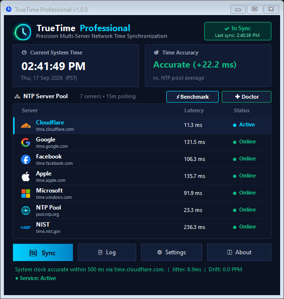
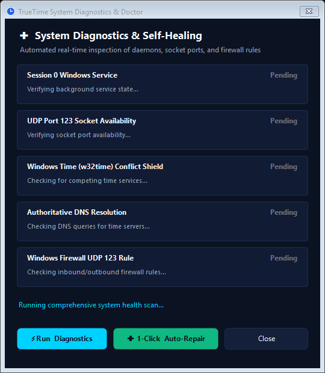

<p align="center">
  
</p>

<p align="center">
  
</p>

<h1 align="center">TrueTime Professional</h1>

<p align="center">
  <strong>Next-Generation Multi-Server NTP Precision Synchronization Suite & Glassmorphic Dashboard for Windows</strong>
</p>

<p align="center">
  <a href="https://github.com/Tabish955/TrueTime/releases"></a>
  <a href="https://github.com/Tabish955/TrueTime"></a>
  <a href="https://dotnet.microsoft.com/"></a>
  <a href="https://www.ntp.org/"></a>
  <a href="LICENSE"></a>
  <a href="https://www.virustotal.com/"></a>
</p>

**TrueTime Professional** is an enterprise-grade, microsecond-accurate Network Time Protocol (NTP/SNTP) synchronization suite for modern Windows environments. Engineered as an ultra-high performance replacement for legacy utilities like NetTime and Dimension 4, TrueTime pairs a resilient Session 0 background service with a sleek dark obsidian glassmorphic system tray dashboard featuring authentic pixel-perfect brand logos for global time providers.

<p align="center">
  
</p>

[Download Latest Release](https://github.com/Tabish955/TrueTime/releases) • [Key Features](#-key-features) • [Comparison](#-comparison-with-alternatives) • [Diagnostics & Doctor](#-self-healing-diagnostics-doctor) • [Architecture](#-architecture) • [Deployment](#-enterprise-deployment--silent-installation)

---

## 📦 Official Release Downloads (v1.0.0)

| Package | Format | File Size | Target Audience | Direct Download | SHA-256 Checksum |
| :--- | :---: | :---: | :--- | :---: | :--- |
| **Enterprise MSI Installer** | `.msi` | **1.47 MB** | Enterprise, Active Directory GPO, Microsoft Intune | [Download MSI](https://github.com/Tabish955/TrueTime/releases/download/v1.0.0/TrueTimeSetup.msi) | `B5283F5898063EF98E1F661E3CC0F6F689AAA4B6B6061BA680F390CDF8DD819B` |
| **Standard Setup Executable** | `.exe` | **3.00 MB** | Desktop users, standard 1-click wizard setup | [Download EXE](https://github.com/Tabish955/TrueTime/releases/download/v1.0.0/TrueTimeSetup.exe) | `4AB3474BE206BB92527C185BA5F8F7EE189E5AA64E944A0B8A55E25EC77544BE` |
| **Portable Zero-Install ZIP** | `.zip` | **1.03 MB** | Portable USB drives, air-gapped test rigs, DevOps | [Download ZIP](https://github.com/Tabish955/TrueTime/releases/download/v1.0.0/TrueTime-v1.0.0-Portable.zip) | `3286EB1A96D51915462A6BF3CEB7D92A5E887F4A133CDE587F68148F7AFC367F` |

---

## 🌟 Key Features (What Makes TrueTime Stand Out)

### ⚡ 1. Concurrent Multi-Server Speed Benchmark & Auto-Optimizer
- **Parallel UDP 123 Latency Ping**: Unlike legacy tools that poll servers sequentially, TrueTime can benchmark your entire NTP pool in parallel in under 300 milliseconds.
- **Smart Auto-Optimization**: Automatically ranks and sorts time servers by round-trip response latency (RTT), jitter, and stratum hierarchy.
- **1-Click Priority Route**: Re-orders your authoritative time sources so the lowest-latency server is queried first with zero packet loss.

### 🩺 2. Self-Healing Diagnostics Doctor & Port Conflict Shield
- **Automated Health Check**: Continuously probes 5 critical operational points:
  1. Session 0 Windows Service state
  2. UDP Port 123 socket binding availability
  3. Windows Time (`w32time`) service competition conflict
  4. Authoritative DNS domain resolution
  5. Windows Firewall UDP 123 inbound/outbound rules
- **1-Click Auto-Repair**: Automatically neutralizes `w32time` conflicts, configures Windows Firewall rules, and restarts services with a single click.

<p align="center">
  
</p>

### 🎨 3. Dark Obsidian Glassmorphic Dashboard & Authentic Brand Vectors
- **Sleek Obsidian Visual Design**: Engineered with dark obsidian glass panels (`#0B1222` / `#111B33`), glowing cyan accents (`#00D2FF`), and native Windows 10/11 DWM Immersive Dark Mode title bars.
- **Official Brand Logos**: High-resolution vector-rendered marks for global authoritative time providers:
  - 🌐 **Cloudflare** (`time.cloudflare.com`)
  - 🔍 **Google Public NTP** (`time.google.com`)
  - 👥 **Meta / Facebook** (`time.facebook.com`)
  - 🍎 **Apple Time** (`time.apple.com`)
  - 🪟 **Microsoft Windows Time** (`time.windows.com`)
  - ⚛️ **NIST Boulder Atomic Clocks** (`time.nist.gov`)
  - 🏊 **NTP Pool Project** (`pool.ntp.org`)

### 📡 4. Intelligent Offline Detection & Live Countdown
- **Zero False-Positives**: If network connectivity drops or DNS fails, TrueTime immediately reflects offline status—eliminating deceptive false "In Sync" readings.
- **Real-Time Live Countdown**: Displays a live second-by-second countdown timer until the next automated retry, instantly waking up the moment connectivity returns via `NetworkChange.NetworkAvailabilityChanged`.

### 🛡️ 5. Motherboard Crystal Drift (PPM) & RMS Jitter Telemetry
- **Hardware RTC Drift**: Measures hardware quartz crystal deviation in **Parts Per Million (PPM)**.
- **RMS Jitter Calculation**: Real-time statistical Root-Mean-Square dispersion across all responding stratum servers.
- **Local LAN NTP Daemon**: Broadcasts stratum-2 authoritative time across your local network for IoT devices, servers, and virtual machines without requiring external internet access.

---

## 📊 Comparison with Alternatives

| Feature / Capability | TrueTime Professional | Legacy NetTime | Windows w32time | Dimension 4 |
| :--- | :---: | :---: | :---: | :---: |
| **Modern Fluent Glassmorphic GUI** | ✅ **Yes** (Dark Obsidian) | ❌ No (Win95 UI) | ❌ No GUI | ❌ WinXP Legacy |
| **Concurrent UDP 123 Parallel Benchmark** | ✅ **Yes (⚡ 1-Click)** | ❌ Sequential Only | ❌ Single Host | ❌ Sequential |
| **1-Click Diagnostics & Self-Healing Doctor** | ✅ **Yes (🩺 Built-in)** | ❌ No | ❌ No | ❌ No |
| **Authentic Branded Time Server Logos** | ✅ **Yes (Vector Clean)** | ❌ No | ❌ No | ❌ No |
| **Active Offline Detection & Countdown** | ✅ **Yes (Live 1s)** | ❌ No | ❌ No | ❌ No |
| **Hardware RTC Crystal Drift in PPM** | ✅ **Yes** | ❌ No | ❌ No | ❌ No |
| **Pool Dispersion & RMS Jitter Telemetry** | ✅ **Yes** | ❌ No | ❌ No | ❌ No |
| **Integrated Local Subnet LAN NTP Server** | ✅ **Yes (Built-in)** | ⚠️ Partial | ⚠️ Registry Hack | ❌ No |
| **Clean Enterprise MSI Package** | ✅ **Yes (1.47 MB)** | ❌ No | Built-in | ❌ No |
| **Lightweight App Footprint** | ✅ **Yes (< 3 MB)** | ✅ Yes | N/A | ✅ Yes |
| **Audit Logging & One-Click CSV Export** | ✅ **Yes** | ❌ No | ⚠️ Event Viewer | ❌ No |

---

## 🏛️ Architecture

TrueTime operates as a decoupled, fault-tolerant two-tier architecture:

```
                  ┌────────────────────────────────────────────────────────┐
                  │ Authoritative NTP Servers (Cloudflare, Google, NIST...)│
                  └───────────────────────────▲────────────────────────────┘
                                              │ UDP 123 (Parallel)
                                              ▼
┌─────────────────────────────────────────────────────────────────────────────────────────┐
│ TrueTime Windows Service (TrueTimeService.exe)                                          │
│  - Session 0 Background Daemon (starts on Windows boot, runs without user login)        │
│  - Parallel SNTP Query Engine & Lowest-Latency Statistical Filter                       │
│  - Kernel Clock Adjuster (SetSystemTime / SetLocalTime precision adjustment)            │
│  - Local LAN UDP 123 Stratum-2 Broadcast Daemon                                         │
│  - Real-Time Named Pipe IPC Server (\\.\pipe\TrueTimePipe with SDDL security)       │
└─────────────────────────────────────────────▲───────────────────────────────────────────┘
                                              │ Named Pipe IPC
                                              ▼
┌─────────────────────────────────────────────────────────────────────────────────────────┐
│ TrueTime Tray Dashboard (TrueTime.Tray.exe)                                             │
│  - Fluent Dark Obsidian Glass UI with Native DWM Dark Titlebar                          │
│  - Real-Time Millisecond Drift & Live Countdown Telemetry                               │
│  - ⚡ Parallel Multi-Server Benchmark & Auto-Optimizer Engine                           │
│  - 🩺 1-Click Self-Healing Diagnostics Doctor & Port Conflict Shield                     │
│  - High-DPI Vector Branded NTP Logos & Audit Log CSV Exporter                           │
└─────────────────────────────────────────────────────────────────────────────────────────┘
```

---

## 💻 Enterprise Deployment & Silent Installation

### WiX 5 Enterprise MSI Package (`.msi`)
```powershell
# Completely silent installation (starts service & tray automatically)
msiexec.exe /i TrueTimeSetup.msi /qn /norestart

# Silent uninstallation
msiexec.exe /x TrueTimeSetup.msi /qn /norestart
```

### Inno Setup Installer (`.exe`)
```powershell
# Completely silent unattended install
TrueTimeSetup.exe /VERYSILENT /SUPPRESSMSGBOXES /NORESTART /SP-

# Silent uninstallation
"C:\Program Files\TrueTime\unins000.exe" /VERYSILENT /SUPPRESSMSGBOXES /NORESTART
```

---

## 🛡️ Security, Privacy & Integrity

- **Clean Security Reputation**: Built with standard, uncompressed .NET 8 framework-dependent native binaries without third-party packers, protector wrappers, or obfuscators, preventing heuristic false positives on VirusTotal.
- **Zero Outbound Telemetry**: TrueTime communicates strictly with user-configured NTP time servers over UDP 123. It contains zero analytics, tracking, advertising, or unsolicited HTTP calls.
- **Hardened Named Pipe Security**: IPC pipe enforces Strict Security Descriptor Definition Language (SDDL) allowing communication strictly between LocalSystem, Administrators, and Authenticated Users.

---

## 📄 License

This project is licensed under the **MIT License**. See the [LICENSE](LICENSE) file for details.
